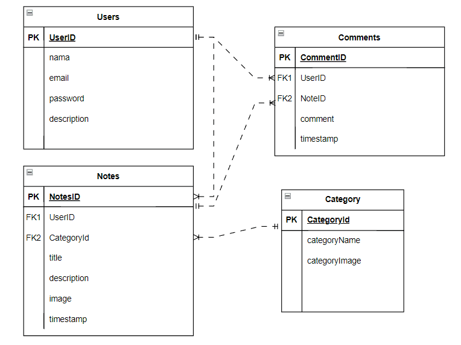
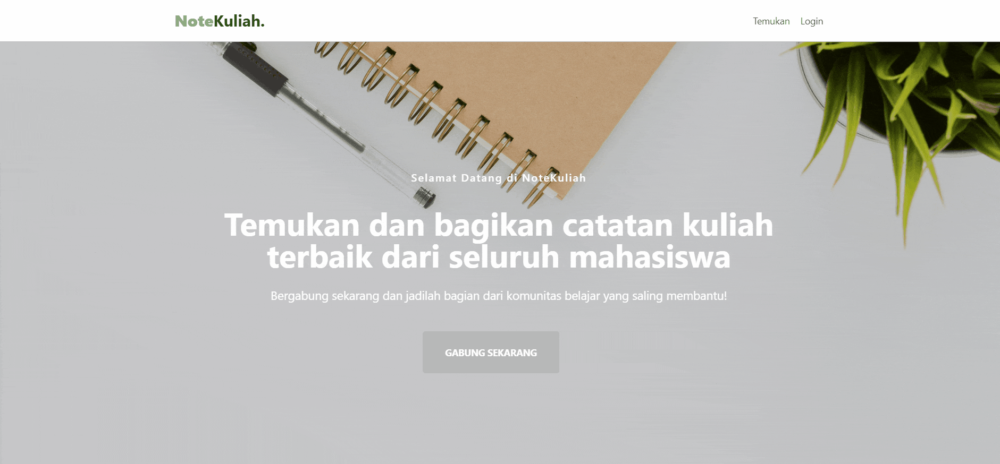
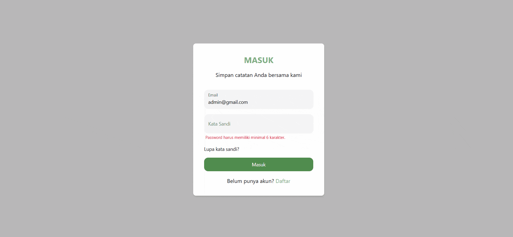
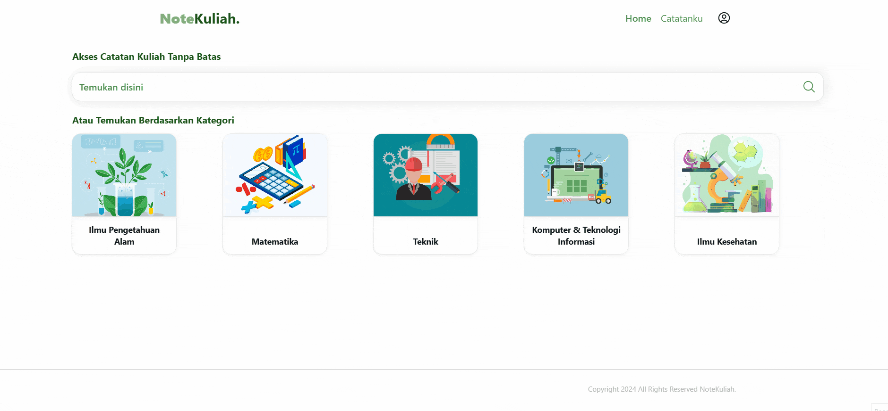

<h1 align="center">NoteKuliah</h1>

<div align="center">

&nbsp;
&nbsp;
&nbsp;
&nbsp;
&nbsp;
&nbsp;
&nbsp;

</div>

<p align="center">NoteKuliah is a collaborative platform for students to share and access quality lecture notes, supporting the learning process and improving material understanding. The application is built with React, Redux for state management, and React Router for routing.</p>

---

## Table of Contents

- [Features](#features)
- [Installation](#installation)
- [Usage](#usage)
- [Running Tests](#running-tests)
- [File and Folder Structure](#file-and-folder-structure)
- [Entity-Relationship Diagram (ERD)](#entity-relationship-diagram-erd)
- [Overview](#overview)
- [License](#license)
- [Contributing](#contributing)
<!-- - [License](#license) -->

---

## Features

- Students can upload lecture notes.
- Efficient search functionality for finding relevant lecture notes.
- Filtering options to refine search results.
- A comment system that allows users to leave feedback and discuss notes.
- Support for well-structured and organized notes.

## Installation

To get started with NoteKuliah, follow these steps:

1. **Clone the repository:**

   ```bash
   git clone https://git.enigmacamp.com/enigma-camp/enigmacamp-2.0/batch-29-reactjs/octavan-adiputra/fp_platform_berbagi_catatan_kuliah.git
   ```

   > Or

   ```bash
   git clone https://github.com/alifsuryadi/fp_platform_berbagi_catatan_kuliah.git
   ```

2. **Navigate to the project directory:**

   ```bash
   cd fp_platform_berbagi_catatan_kuliah
   ```

3. **Create a .env file:**

   ```bash
   cp .env.example .env
   ```

   > Update the `VITE_API_URL` in .env to point to your API base URL.

4. **Install the dependencies:**

   ```bash
   npm install
   ```

5. **Start the development server:**

   ```bash
   npm run dev
   ```

   > The application will be available at http://localhost:5173

## Usage

1. **Running the JSON server:**
   To run the JSON server on port 3000:

   ```bash
   npx json-server -p 3000 db.json
   ```

   > This will start the JSON server at http://localhost:3000/.

2. **Running the Node.js server with Node.js:**
   To run the Node.js server with automatic restarts on file changes:

   ```bash
   node server.js
   ```

   > This will start the Node.js server.

## Running Tests

To run unit tests using Vitest:

```bash
npx vitest
```

## File and Folder Structure

| File/Folder Name                    | Description                                 |
| ----------------------------------- | ------------------------------------------- |
| `src/App.jsx`                       | Main application component.                 |
| `src/index.jsx`                     | Entry point of the application.             |
| `src/components/LoadingSpinner.jsx` | Reusable loading spinner component.         |
| `src/components/Navigation.jsx`     | Navigation bar component.                   |
| `src/pages/LandingPage.jsx`         | Component for the landing page.             |
| `src/pages/LoginPage.jsx`           | Component for the login page.               |
| `src/pages/RegisterPage.jsx`        | Component for the registration page.        |
| `src/pages/HomePage.jsx`            | Component for the homepage.                 |
| `src/pages/ProfilePage.jsx`         | Component for the user profile page.        |
| `src/pages/PengaturanPage.jsx`      | Component for the settings page.            |
| `src/pages/ListUserNotesPage.jsx`   | Component to list notes by a specific user. |
| `src/pages/NoteDetails.jsx`         | Component for note details.                 |
| `src/pages/ListAllNotes.jsx`        | Component to list all notes.                |
| `src/pages/ListNotes.jsx`           | Component for listing notes with filters.   |
| `src/pages/NotFound.jsx`            | Component for 404 error page.               |
| `src/routes/Routes.jsx`             | Configuration for application routes.       |
| `src/store/`                        | Contains Redux store and slices.            |
| `public/`                           | Static assets.                              |
| `db.json`                           | JSON server database.                       |
| `server.js`                         | Node.js server script.                      |
| `package.json`                      | Project dependencies and scripts.           |
| `README.md`                         | Project documentation.                      |

## Entity-Relationship Diagram (ERD)

The ERD for NoteKuliah is as follows:



## Overview

- Landing Page
  

- Notes
  
- Management Notes
  

## License

This project is licensed under the [MIT License](LICENSE.md)

## Contributing

Contributions are welcome! If you'd like to contribute, please fork the repository and use a feature branch. Pull requests are warmly welcome.
